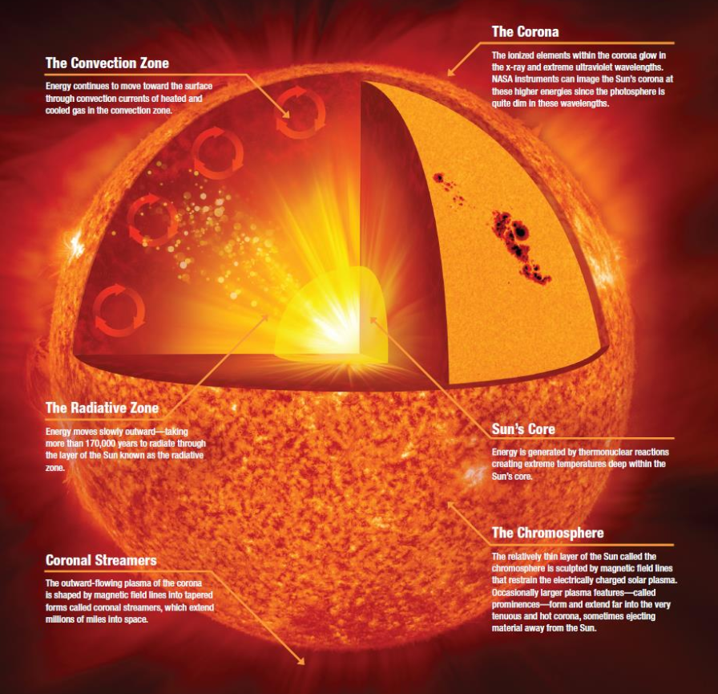

# The general structure of the SUN 
## A few layers of the SUN

1. The SUN's Core
    - Thermonuclear reactions creating extreme temperatures generates the SUN's energy deep within the core
2. The Radiative zone
    - Within this zone, the energy moves slowly outward.
    - This process takes more than 170,000 years to radiate through the layer of the Sun
3. The Convection Zone
    - Energy continues to move toward the surface through convection currents of heated and cooled gas in the convection zone
4. The Corona
    - The ionized elements within the corona glow in the x-ray and extreme ultraviolet wavelengths.
    - NASA instruments can image the SUN's corona at the higher energies since the photosphere is quite dim in these wave lengths
5.  The Chromosphere
    - The relatively thin layer of the SUN called chromosphere is sculpted by magnetic field lines that restrain the electrically charge solar plasma.
    - Occasionally larger plasma features, prominences, form and extend far into the very tenuous and hot corona, sometimes ejecting material away from the SUN

 (source: https://cesar.esa.int/upload/201807/the_suns_structure_booklet.pdf)

